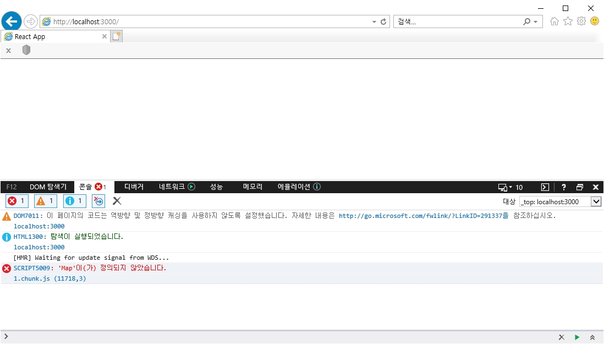

# 아이디어스 과제 저장소

**[시연해보기][link]**

[link]: https://ddock4you.github.io/idus-test 'Go'

## Stack

React, styled-component,

## [문의사항]

코드테스트 문서에서 요구사항 중에 `IE 10+`이 있었는데 IE 11 이상은 작동되는 것을 확인했으나 IE 10 에서만 작동 되지 않는 문제가 있습니다.

IE 10에서도 작동되게끔 하려고 구글링도 해보고 같이 공부하는 동료에게도 물어봤으나 제대로 작동시키지 못했습니다.

<!-- 혹시 제 코드를 보게 되신다면 어떤 작업을 추가로 해야하는지 알려주실 수 있을까요? -->

### 테스트

- IE 11을 실행해서 관리자 모드를 켠 후 에뮬레이션 메뉴에서 문서모드를 10 으로 설정하여 테스트했습니다.

### 증상

- IE 10에서 과제 페이지 접속 시 콘솔 오류 발생하면서 페이지에 아무것도 뜨지 않는 문제 발생

```console
    SCRIPT5009: 'Map'이(가) 정의되지 않았습니다.
    1.chunk.js (11718,3)
```



### 시도해 본 방법

- core-js 설치 및 적용 (2버전 대 구형 버전도 설치 후 적용도 해보았습니다.)
- regenerator-runtime 설치 및 적용 (@babel/polyfill을 적용하려 했으나 babel 7.4.0 버전이후로 사용되지 않는다고 해서 이 방법을 적용)
- react-app-polyfill 설치 및 적용
- pakage.json에서 browserlist 설정 변경
- react-scripts 구형 버전 설치

### IE 10 지원을 위해 참조한 문서

<https://github.com/facebook/create-react-app/tree/master/packages/react-app-polyfill>
<https://velog.io/@pks787/react-IE%EC%97%90%EC%84%9C-%EC%9E%91%EB%8F%99%EC%8B%9C%ED%82%A4%EA%B8%B0>
<https://stackoverflow.com/questions/53631949/why-ie-11-display-blank-page-rendering-react-app>
<https://github.com/facebook/create-react-app/issues/6989>
<https://reactjs.org/docs/javascript-environment-requirements.html>
<https://okchangwon.tistory.com/3>
<https://okchangwon.tistory.com/3>
